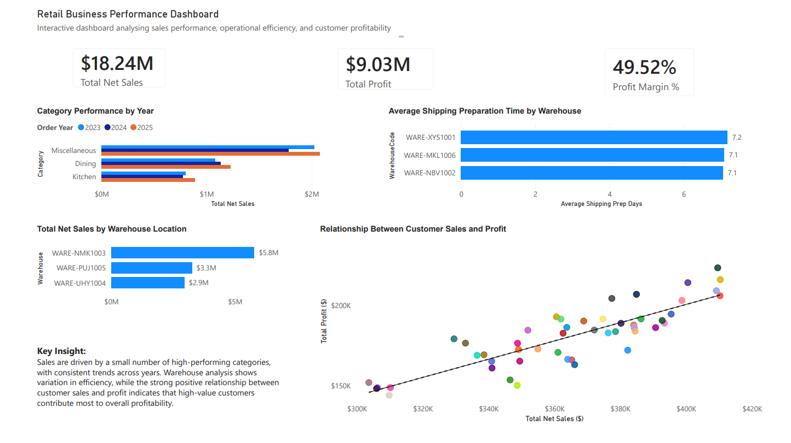

# Retail Business Performance Dashboard

## 📊 Project Overview

This project presents an interactive Power BI dashboard designed to analyse retail business performance across multiple dimensions, including sales, profitability, warehouse efficiency, and customer value.

The goal of this analysis is to support data-driven decision-making by identifying key trends, operational inefficiencies, and high-performing areas within the business.

---

## 📷 Dashboard Preview



---

## 🔍 Key Business Insights

* **Sales Concentration:** A small number of product categories consistently generate the majority of total sales across all years (2023–2025)
* **Operational Efficiency:** Warehouse shipping preparation times are relatively consistent, with only minor variations between locations
* **Sales Performance:** Profit margins are similar across regions, indicating balanced performance among salespeople
* **Warehouse Strategy:** Certain warehouses contribute significantly less revenue and may be considered for optimisation or closure
* **Customer Value:** A strong positive relationship exists between customer sales and profit, showing that high-value customers drive profitability

---

## 🧠 Analysis Questions Addressed

This dashboard answers key business questions:

1. What are the top 5 product categories by net sales (2023–2025)?
2. Are there warehouses that take longer to prepare orders for shipping?
3. Which salesperson has the highest profit margin in each region?
4. Which warehouse(s) should be shut down based on performance?
5. What is the relationship between customer sales and profit?

---

## ⚙️ Data Preparation & Transformation

Data was cleaned and transformed in Power BI to ensure accurate analysis:

* Corrected data types (dates, numerical values, and text fields)
* Created key measures using DAX:

  * **Total Net Sales**
  * **Total Profit**
  * **Profit Margin (%)**
* Calculated **Shipping Preparation Time** using date differences
* Established relationships between datasets:

  * Sales Orders, Customers, Products, Salespeople, and Stores
* Applied **ranking logic (RANKX)** to identify top-performing salespeople by region
* Aggregated data by year, category, warehouse, and customer for analysis

---

## 🛠 Tools & Technologies

* **Power BI Desktop**
* **DAX (Data Analysis Expressions)**
* **Data Modelling & Transformation**
* **Excel / CSV datasets**

---

## 📁 Repository Structure

```
├── Retail_Performance_Dashboard.pbix   # Power BI dashboard file
├── Retail_Performance_Dashboard.pdf    # Exported dashboard
├── dashboard.png                       # Dashboard preview image
├── data/                               # Raw datasets used
└── README.md                           # Project documentation
```

---

## 📈 Key Features of the Dashboard

* KPI Cards for high-level performance metrics
* Comparative category analysis across multiple years
* Warehouse efficiency analysis
* Profit margin comparison by region
* Customer-level sales vs profit relationship (scatter plot with trendline)
* Clean and intuitive layout for easy interpretation

---

## 💡 Business Value

This dashboard provides actionable insights that can help organisations:

* Focus on high-performing product categories
* Improve warehouse efficiency
* Identify underperforming locations
* Optimise sales strategies
* Better understand customer profitability

---

## 👤 Author

**Rabita Sami**
Business Information Systems Student – Curtin University

---

## 📌 Notes

This project was developed as part of an academic assignment using a structured dataset.
All analysis and insights were derived using Power BI and reviewed for accuracy.
